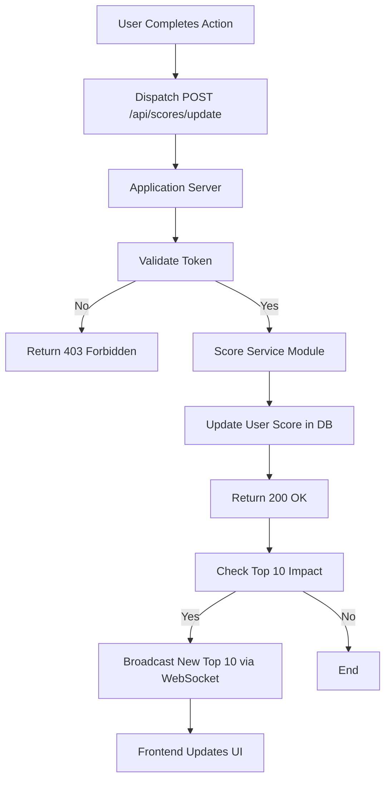

# Overview

This document specifies the design and requirements for a new backend module responsible for managing and updating user scores. The primary function of this service is to receive score update requests, validate them, and persist the new scores. It also provides an API endpoint to retrieve the top 10 user scores for display on a live-updating scoreboard.

## Functional Requirements

- Score Update API: An endpoint to securely receive and process requests to increment a user's score.
- Live Scoreboard: Retrieve the top 10 user scores, ordered from highest to lowest. And provide a mechanism for live updates to the scoreboard.

## Flow chart



### 1. Top 10 user Scoreboard

- Description: An API endpoint that returns the top 10 user scores. Live-updating scoreboard functionality is required, meaning the scores should be fetched in real-time and displayed on the frontend.
- Endpoint: GET `/api/scores/top10`
- Behavior:
  - A frontend client establishes a WebSocket connection.
  - The server sends the initial top 10 scores immediately upon connection.
  - Whenever a score update occurs that affects the top 10 list, the server broadcasts the new list to all connected clients.
  - Clients listen for these updates and render the new scoreboard.
- Output:

  - Success (200 OK):

    ```json
    {
      "scores": [
        { "userId": "userA", "score": 1500 },
        { "userId": "userB", "score": 1200 },
        ...
        { "userId": "userJ", "score": 800 }
      ]
    }
    ```

  - Error (500 Internal Server Error):

    ```json
    {
      "message": "Failed to retrieve scores"
    }
    ```

### 2. Update User Score

- Description: An API endpoint that allows a user to increment their score.
- Endpoint: POST `/api/scores/update`
- Behavior:
  - The request must include the user's ID and the score increment.
  - The server validates the request to ensure the user exists and the increment is a positive integer.
  - If valid, the server updates the user's score in the database.
  - If the update results in a change to the top 10 scores, it broadcasts the updated list to all connected clients.
- Output:

  - Success (200 OK):

    ```json
    {
      "message": "Score updated successfully",
      "newScore": 1600
    }
    ```

  - Error (400 Bad Request):

    ```json
    {
      "message": "Invalid request: userId and increment are required"
    }
    ```

  - Error (403 Forbidden):

    ```json
    {
      "message": "Unauthorized score update attempt"
    }
    ```

  - Error (500 Internal Server Error):

    ```json
    {
      "message": "Failed to update score"
    }
    ```

## Non-Functional Requirements

- Authentication: All API requests must be authenticated using a secure token. Upon user sign-in, a JWT (JSON Web Token) is issued as a Bearer token. This token must be included in the Authorization header of all requests (e.g., Authorization: Bearer <token>). The token is validated on each request to ensure it is signed correctly and not expired.
- Authorization: Only authenticated users can update their scores. The service must validate that the user making the request, as identified by the JWT, is the same as the user whose score is being updated. The userId in the request body must match the sub claim in the JWT.
- Input Validation: The service must validate all incoming requests to prevent malicious inputs.

## Additional comments

- Cache top 10 scores to improve performance.
- Can use polling in place of WebSocket for live updates if WebSocket is not feasible.
